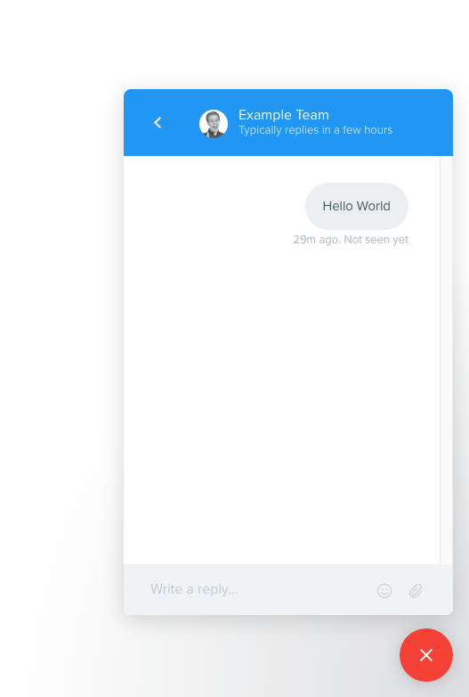

# Intercom Fashion

**Please note: Intercom does not officially support skinning their messenger.**

## Install

```sh
npm i --save intercom-fashion
```

## Usage

```js
// ES6
import IntercomFashion from 'intercom-fashion';

// ES5
const IntercomFashion = require('intercom-fashion');
```

```html
<script src="node_modules/intercom-fashion/dist/intercom-fashion.js"></script>
```

**then...**

```js
IntercomFashion.init();
```

### Loading a custom CSS file

```js
IntercomFashion.load('/path/to/your/custom.css');
```

### Adding inline CSS

```js
IntercomFashion.style(`
    #intercom-container * {
        outline: 2px solid rgba(255, 0, 0, .25) !important;
    }
`);
````

### Using presets

```js
IntercomFashion.config({
    userBubble: {
        color: '#455A64',        // User's bubble text color
        background: '#ECEFF1',   // User's bubble background color
        rounded: true            // Whether the user's bubble is rounded
    },
    adminBubble: {
        color: 'white',          // Admin's bubble text color
        background: '#4CAF50',   // Admin's bubble background color
        rounded: true            // Whether the admin's bubble is rounded
    },
    newConversation: {
        color: '#fff',           // The "new conversation" button text color
        background: '#F44336'    // The "new conversation" button background color
    },
    launcherButton: {
        icon: 'logo.png',        // The launcher's closed icon image url
        background: '#F44336'    // The launcher's background color
    },
    header: {
        color: '#fff',           // The header's text color
        background: '#2196F3'    // The header's background color
    },
    modal: {
        background: '#424242'    // The attachment preview modal background color
    },
    conversation: {
        background: '#fff'       // The conversation background color
    },
    tooltip: {
        color: '#f8f8f8',        // The tooltip text color
        background: '#000',      // The tooltip background color
        rounded: true            // Whether the tooltip is rounded
    }
});
```

## Screenshot

